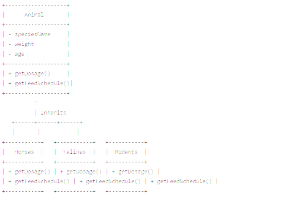

# hayvanat-bahcesi-yonetimi

Hayvanat bahçesi hayvanları için bir sınıf diyagramı tasarlarken, temelde hayvanların ortak özelliklerini barındıran bir üst sınıf ve bu sınıftan türeyen, özelleşmiş alt sınıflar oluşturmanız gerekecek. Bu yapı, polimorfizmi kullanarak farklı hayvan gruplarının beslenme ve ilaç dozajı gibi özelliklerini gruplara özgü biçimde ele almanızı sağlar. İşte bu sistemi modellemek için bir sınıf diyagramı:

Sınıflar ve İlişkiler
Animal (Hayvan) Sınıfı:

Bu sınıf, tüm hayvan türlerinin temelini oluşturur.
Ortak özellikler: speciesName (tür adı), weight (ağırlık), age (yaş).
Ortak metotlar: getDosage() ve getFeedSchedule() - Bu metodlar türetilmiş sınıflarda özelleştirilecektir.
Horses (Atlar) Sınıfı:

Animal sınıfından türetilmiştir.
getDosage() ve getFeedSchedule() metodları bu sınıfa özgü şekilde uygulanır.
Felines (Kedigiller) Sınıfı:

Animal sınıfından türetilmiştir.
Kaplanlar, aslanlar gibi kedigiller için özelleştirilmiş getDosage() ve getFeedSchedule() metodları içerir.
Rodents (Kemirgenler) Sınıfı:

Animal sınıfından türetilmiştir.
Sıçanlar, kunduzlar gibi kemirgenler için özelleştirilmiş getDosage() ve getFeedSchedule() metodları içerir.

Sınıf Diyagramı Taslağı

Açıklama
Animal: Temel sınıf olarak, tüm hayvanların ortak niteliklerini ve metodlarını içerir. getDosage() ve getFeedSchedule() metodları, türetilmiş sınıflarda her hayvan türünün ihtiyacına göre uyarlanacak şekilde tanımlanmalıdır.
Horses, Felines, Rodents: Her biri Animal sınıfından türeyen bu alt sınıflar, gruplara özgü ilaç dozajı ve beslenme zamanlarını hesaplamak için gerekli özelleştirmeleri içerir.
Bu yapı, her hayvan grubunun özel ihtiyaçlarını dikkate alarak, sistemde esneklik ve genişletilebilirlik sağlar. Polimorfizm, getDosage() ve getFeedSchedule() metodlarının her hayvan türüne göre farklı çalışmasını kolaylaştırır.

